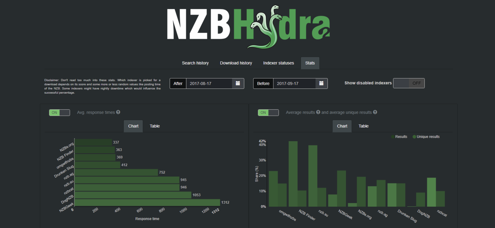

!!! warning
This is not a complete recipe - it's a component of the [AutoPirate](/recipes/autopirate/) "_uber-recipe_", but has been split into its own page to reduce complexity.

# NZBHydra 2

[NZBHydra 2](https://github.com/theotherp/nzbhydra2) is a meta search for NZB indexers. It provides easy access to a number of raw and newznab based indexers. You can search all your indexers from one place and use it as an indexer source for tools like Sonarr, Radarr or CouchPotato.

!!! note
NZBHydra 2 is a complete rewrite of [NZBHydra (1)](/recipes/autopirate/nzbhydra/). It's currently in Beta. It works mostly fine but some functions might not be completely done and incompatibilities with some tools might still exist. You might want to run both in parallel for migration / testing purposes, but ultimately you'll probably want to switch over to NZBHydra 2 exclusively.



Features include:

- Searches Anizb, BinSearch, NZBIndex and any newznab compatible indexers. Merges all results, filters them by a number of configurable restrictions, recognizes duplicates and returns them all in one place
- Add results to [NZBGet](/recipes/autopirate/nzbget/) or [SABnzbd](/recipes/autopirate/sabnzbd/)
- Support for all relevant media IDs (IMDB, TMDB, TVDB, TVRage, TVMaze) and conversion between them
- Query generation, meaning a query will be generated if only a media ID is provided in the search and the indexer doesn't support the ID or if no results were found
- Compatible with [Sonarr](/recipes/autopirate/sonarr/), [Radarr](/recipes/autopirate/radarr/), [NZBGet](/recipes/autopirate/nzbget.md), [SABnzbd](/recipes/autopirate/sabnzbd/), nzb360, CouchPotato, [Mylar](/recipes/autopirate/mylar/), [Lazy Librarian](/recipes/autopirate/lazylibrarian/), Sick Beard, [Jackett/Cardigann](/recipes/autopirate/jackett/), Watcher, etc.
- Search and download history and extensive stats. E.g. indexer response times, download shares, NZB age, etc.
- Authentication and multi-user support
- Automatic update of NZB download status by querying configured downloaders
- RSS support with configurable cache times
- Torrent support (_Although I prefer [Jackett](/recipes/autopirate/jackett/) for this_):
  - For GUI searches, allowing you to download torrents to a blackhole folder
  - A separate Torznab compatible endpoint for API requests, allowing you to merge multiple trackers
- Extensive configurability
- Migration of database and settings from v1

## Inclusion into AutoPirate

To include NZBHydra2 in your [AutoPirate](/recipes/autopirate/) stack, include the following in your autopirate.yml stack definition file:

```
nzbhydra2:
  image: linuxserver/hydra2:latest
  env_file : /var/data/config/autopirate/nzbhydra2.env
  volumes:
   - /var/data/autopirate/nzbhydra2:/config
  networks:
  - internal

nzbhydra2_proxy:
  image: a5huynh/oauth2_proxy
  env_file : /var/data/config/autopirate/nzbhydra2.env
  networks:
    - internal
    - traefik_public
  deploy:
    labels:
      - traefik.frontend.rule=Host:nzbhydra2.example.com
      - traefik.docker.network=traefik_public
      - traefik.port=4180
  volumes:
    - /var/data/config/autopirate/authenticated-emails.txt:/authenticated-emails.txt
  command: |
    -cookie-secure=false
    -upstream=http://nzbhydra2:5076
    -redirect-url=https://nzbhydra2.example.com
    -http-address=http://0.0.0.0:4180
    -email-domain=example.com
    -provider=github
    -authenticated-emails-file=/authenticated-emails.txt
```

--8<-- "premix-cta.md"

## Assemble more tools..

Continue through the list of tools below, adding whichever tools your want to use, and finishing with the **[end](/recipes/autopirate/end/)** section:

- [SABnzbd](/recipes/autopirate/sabnzbd.md)
- [NZBGet](/recipes/autopirate/nzbget.md)
- [RTorrent](/recipes/autopirate/rtorrent/)
- [Sonarr](/recipes/autopirate/sonarr/)
- [Radarr](/recipes/autopirate/radarr/)
- [Mylar](/recipes/autopirate/mylar/)
- [Lazy Librarian](/recipes/autopirate/lazylibrarian/)
- [Headphones](/recipes/autopirate/headphones/)
- [Lidarr](/recipes/autopirate/lidarr/)
- [NZBHydra](/recipes/autopirate/nzbhydra/)
- NZBHydra2 (this page)
- [Ombi](/recipes/autopirate/ombi/)
- [Jackett](/recipes/autopirate/jackett/)
- [Heimdall](/recipes/autopirate/heimdall/)
- [End](/recipes/autopirate/end/) (launch the stack)

## Chef's Notes 📓

1. In many cases, tools will integrate with each other. I.e., Radarr needs to talk to SABnzbd and NZBHydra2, Ombi needs to talk to Radarr, etc. Since each tool runs within the stack under its own name, just refer to each tool by name (i.e. "radarr"), and docker swarm will resolve the name to the appropriate container. You can identify the tool-specific port by looking at the docker-compose service definition.
2. Note that NZBHydra2 _can_ co-exist with NZBHydra (1), but if you want your tools (Sonarr, Radarr, etc) to use NZBHydra2, you'll need to change both the target hostname (_to "hydra2"_) and the target port (_to 5076_).
