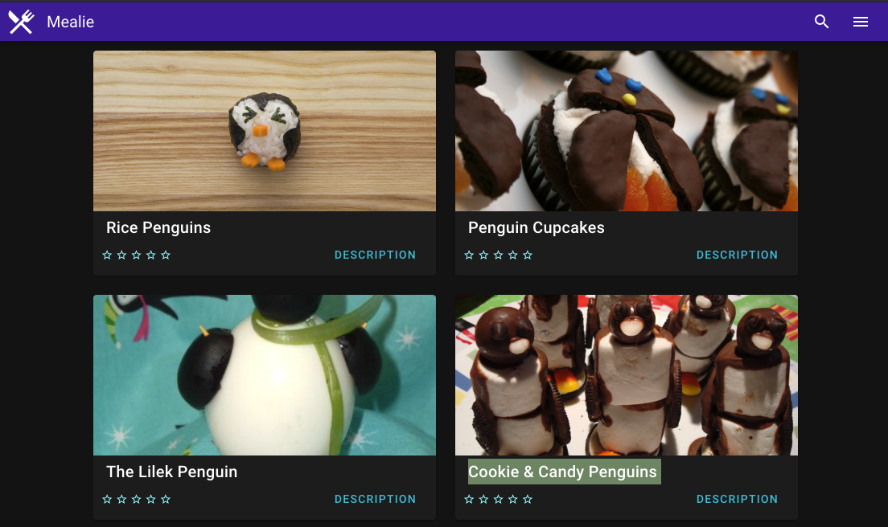
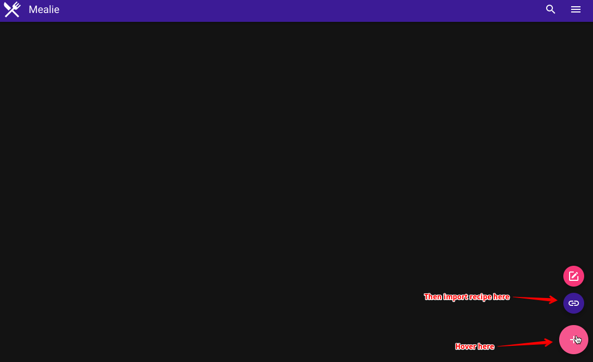

# Mealie

[Mealie](https://github.com/hay-kot/mealie) is a self hosted recipe manager and meal planner (*with a RestAPI backend and a reactive frontend application built in Vue for a pleasant user experience*) for the whole family.

Easily add recipes into your database by providing the url, and mealie will automatically import the relevant data or add a family recipe with the UI editor.



Mealie also provides a secure API for interactions from 3rd party applications. 

!!! question "Why does my recipe manager need an API?"
     An API allows integration into applications like Home Assistant that can act as notification engines to provide custom notifications based of Meal Plan data to remind you to defrost the chicken, marinade the steak, or start the CrockPot. See the [official docs](https://hay-kot.github.io/mealie/) for more information. Additionally, you can access any available API from the backend server. To explore the API spin up your server and navigate to http://yourserver.com/docs for interactive API documentation.

--8<-- "recipe-standard-ingredients.md"

## Preparation

### Setup data locations

First we create a directory to hold the data which mealie will serve:

```
mkdir /var/data/mealie
```

### Create environment

There's only one environment variable currently required (`db_type`), but let's create an `.env` file anyway, to keep the recipe consistent and extensible.

```
mkdir /var/data/config/mealie
cat << EOF > /var/data/config/mealie/mealie.env
db_type=sqlite
EOF
```

### Setup Docker Swarm

Create a docker swarm config file in docker-compose syntax (v3), something like this:

--8<-- "premix-cta.md"

```yaml
version: "3.2" # https://docs.docker.com/compose/compose-file/compose-versioning/#version-3

services:
  app:
    image: hkotel/mealie:latest
    env_file: /var/data/config/mealie/mealie.env
    volumes:
      - /var/data/mealie:/app/data
      - /etc/localtime:/etc/localtime:ro
    deploy:
      labels:
        # traefik
        - traefik.enable=true
        - traefik.docker.network=traefik_public

        # traefikv1
        - traefik.frontend.rule=Host:mealie.example.com
        - traefik.port=9000
        - traefik.frontend.auth.forward.address=http://traefik-forward-auth:4181
        - traefik.frontend.auth.forward.authResponseHeaders=X-Forwarded-User
        - traefik.frontend.auth.forward.trustForwardHeader=true        

        # traefikv2
        - "traefik.http.routers.mealie.rule=Host(`mealie.example.com`)"
        - "traefik.http.routers.mealie.entrypoints=https"
        - "traefik.http.services.mealie.loadbalancer.server.port=9000"
        - "traefik.http.routers.mealie.middlewares=forward-auth"

    networks:
      - traefik_public

networks:
  traefik_public:
    external: true
```

## Serving

### Mealie is served!

Launch the mealie stack by running ```docker stack deploy mealie -c <path -to-docker-compose.yml>```. The first time you access Mealie at https://<YOUR URL/>, you might think there's something wrong. There are **no** recipes, and no instructions. Hover over the little plus sign at the bottom right, and within a second, two icons appear. Click the "link" icon to import a recipe from a URL:




[^1]: If you plan to use Mealie for fancy things like an early-morning alarm to defrost the chicken, you may need to customize the [Traefik Forward Auth][tfa] rules, or even remove them entirely, for unauthenticated API access.
[^2]: If you think Mealie is tasty, encourage the developer :cook: to keep on cookin', by [sponsoring him](https://github.com/sponsors/hay-kot) :heart:

--8<-- "recipe-footer.md"