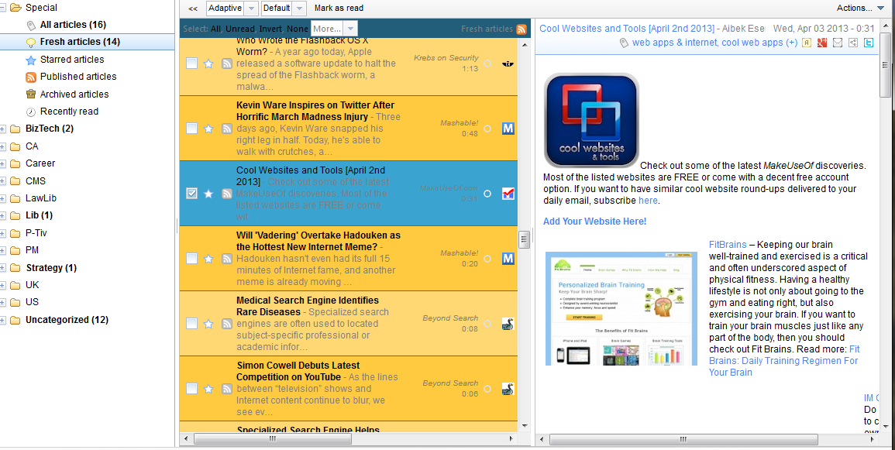

# Tiny Tiny RSS

[Tiny Tiny RSS](https://tt-rss.org/) is a self-hosted, AJAX-based RSS reader, which rose to popularity as a replacement for Google Reader. It supports ~~geeky~~ advanced features, such as:

* Plugins and themeing in a drop-in fashion
* Filtering (discard all articles with title matching "trump")
* Sharing articles via a unique public URL/feed



## Ingredients

1. [Docker swarm cluster](/ha-docker-swarm/) with [persistent shared storage](/ha-docker-swarm/shared-storage-ceph.md)
2. [Traefik](/ha-docker-swarm/traefik) configured per design

## Preparation

### Prepare environment

Create ttrss.env, and populate with the following variables, customizing at least the database password (POSTGRES_PASSWORD **and** DB_PASS) and the TTRSS_SELF_URL to point to your installation.

```
# Variables for postgres:latest
POSTGRES_USER=ttrss
POSTGRES_PASSWORD=mypassword
DB_EXTENSION=pg_trgm

# Variables for funkypenguin/docker-ttrss
DB_USER=ttrss
DB_PASS=mypassword
DB_PORT=5432
DB_PORT_5432_TCP_ADDR=db
DB_PORT_5432_TCP_PORT=5432
TTRSS_SELF_URL=https://ttrss.example.com
TTRSS_REPO=https://github.com/funkypenguin/tt-rss.git
S6_BEHAVIOUR_IF_STAGE2_FAILS=2
```

### Setup docker swarm

```
version: '3'

services:
    db:
      image: postgres:latest
      env_file: /var/data/ttrss/ttrss.env      
      networks:
        - internal
      volumes:
        - /var/data/ttrss/database:/var/lib/postgresql/data
      deploy:
        restart_policy:
          delay: 10s
          max_attempts: 10
          window: 60s

    app:
      image: x86dev/docker-ttrss
      env_file: /var/data/ttrss/ttrss.env
      deploy:
        labels:
          - traefik.frontend.rule=Host:ttrss.example.com
          - traefik.docker.network=traefik
          - traefik.port=8080
        restart_policy:
          delay: 10s
          max_attempts: 10
          window: 60s
      networks:
        - internal
        - traefik

networks:
  traefik:
    external: true
  internal:
    driver: overlay
    ipam:
      config:
        - subnet: 172.16.5.0/24
```

## Serving

### Launch TTRSS stack

Launch the TTRSS stack by running ```docker stack deploy ttrss -c <path -to-docker-compose.yml>```

Log into your new instance at https://**YOUR-FQDN** - the first user you create will be an administrative user.


## Chef's Notes

There are several TTRSS containers available on docker hub, none of them "official". I chose [x86dev's container](https://github.com/x86dev/docker-ttrss) for its features - such as my favorite skins and plugins, and the daily automatic updates from the "rolling release" master. Some of the features of the container I use are due to a [PR](https://github.com/x86dev/docker-ttrss/pull/12) I submitted:

1. Docker swarm looses the docker-compose concept of "dependencies" between containers. In the case of this stack, the application server typically starts up before the database container, which causes the database autoconfiguration scripts to fail, and brings up the app in a broken state. To prevent this, I  include "[wait-for](https://github.com/Eficode/wait-for/)", which (combined with "S6_BEHAVIOUR_IF_STAGE2_FAILS=2"), will cause the app container to restart (and attempt to auto-configure itself) until the database is ready.

2. The upstream git URL [changed recently](https://discourse.tt-rss.org/t/gitlab-is-overbloated-shit-garbage/325/6), but my experience of the new repository is that it's **SO** slow, that the initial "git clone" on setup of the container times out. To work around this, I created [my own repo](https://github.com/funkypenguin/tt-rss.git), cloned upstream, pushed it into my repo, and pointed the container at my own repo with TTRSS_REPO. I don't get the _latest_ code changes, but at least the app container starts up. When upstream git is performing properly, I'll remove TTRSS_REPO to revert back to the "rolling release".
